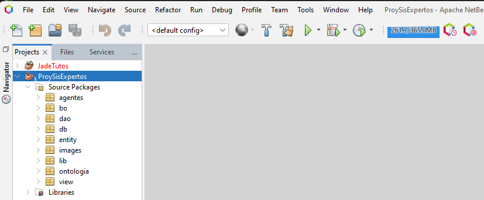
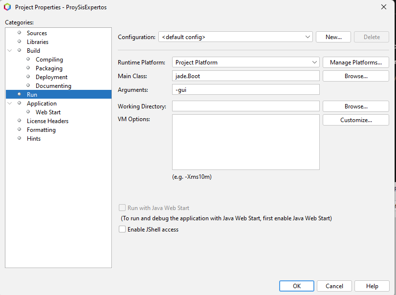
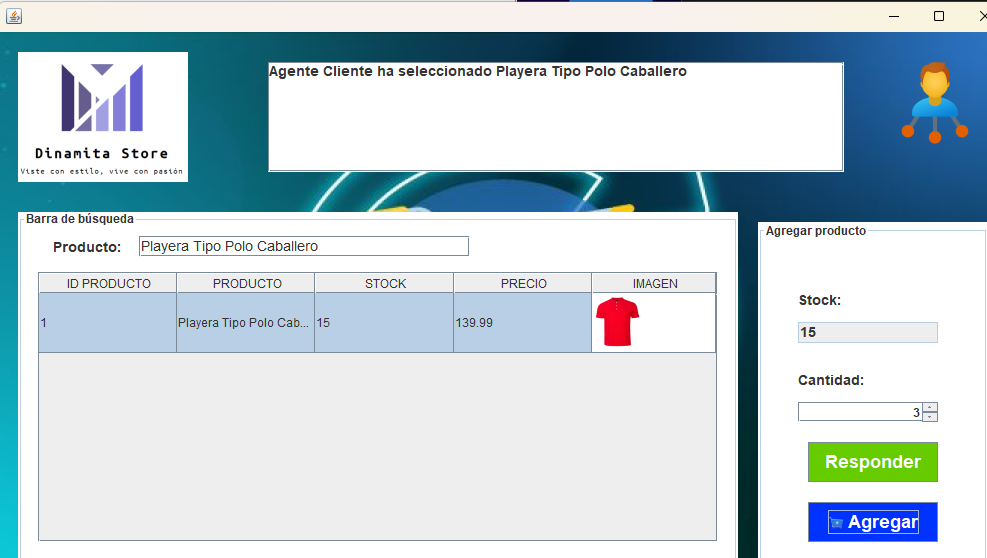
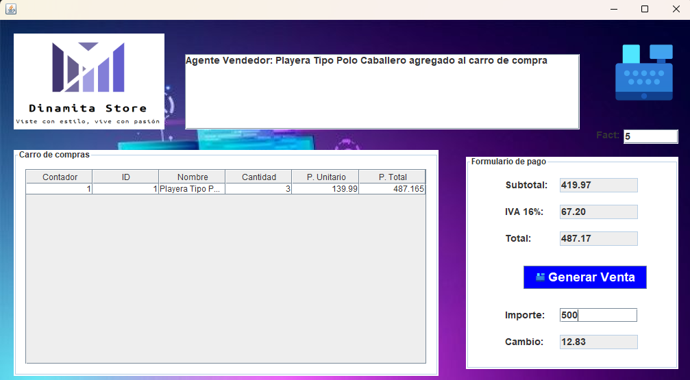
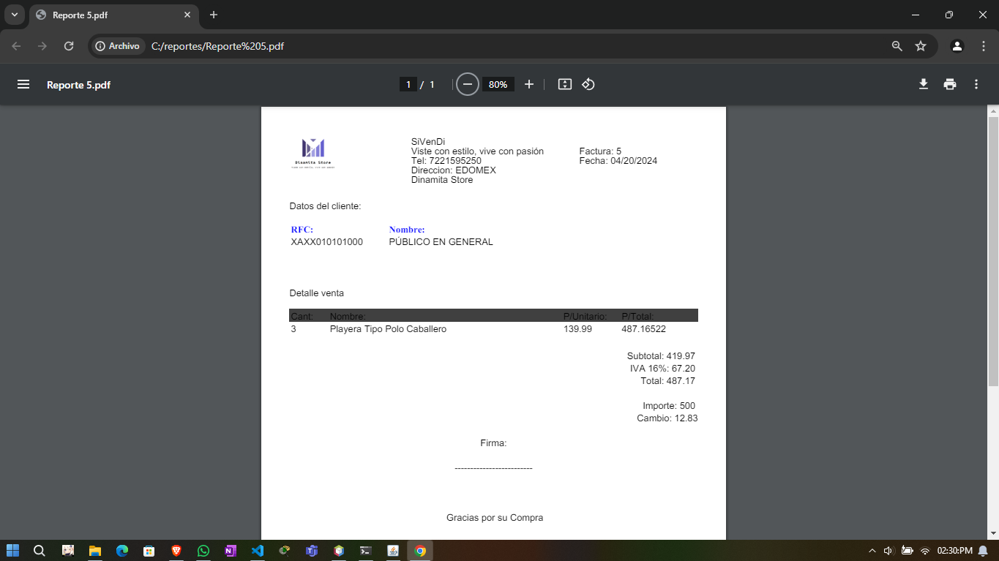

El README se ve bastante completo y bien estructurado. Sin embargo, aquí tienes algunas sugerencias para mejorarlo:

---

# Sistema de ventas con JADE (agentes)

_Sistema de ventas creado para la materia sistemas expertos, utilizando una base de datos en SQLite, JADE para los agentes, además de generar reportes PDF una vez terminada la venta._

## Comenzando 🚀

_Para descargar el proyecto, sigue las siguientes instrucciones:_

* **Opción 1:** Haz clic en "Code" y luego en "Download Zip".
* **Opción 2:** Crea una carpeta, abre la terminal (CMD o Git Bash) y ejecuta:

    ```bash
    git clone https://github.com/KevinGil12C/ProyectoSE.git 
    ```

### Pre-requisitos 📋

* Java 19
* Apache Netbeans

### Configuración 🔧

1. Abre el proyecto en Netbeans.

    

2. Configura los datos de Main Class & Arguments como se muestra en la imagen.

    

    > [!NOTE]  
    > Si es necesario, actualiza la ruta de las librerías del proyecto. Estas se encuentran en la carpeta `src/lib`.

## Ejecutando las pruebas ⚙️

Una vez realizadas las configuraciones, procede a ejecutar el proyecto.

### Iniciar los agentes desde la GUI de JADE 🔩

Durante la ejecución del proyecto, se abrirá la GUI de JADE, que te permitirá crear los siguientes agentes:
* Vendedor
* Cajero
* Cliente

## Iniciar venta 📦

En la vista de cliente, el cliente seleccionará un producto y se enviarán los datos al vendedor, como se muestra en la imagen.

En la vista del vendedor, este seleccionará la cantidad de ese producto que el cliente ha elegido.



El vendedor enviará al cajero la cantidad de productos y se agregarán al carrito, como se muestra en la imagen.



El cajero enviará al cliente una confirmación de que se agrego el producto al carrito, como se muestra en la imagen.


> [!IMPORTANT]  
> Estos pasos se repetirán hasta que se finalice la compra.

### Generación de reportes PDF 📄
El sistema cuenta con la capacidad de generar reportes en formato PDF una vez que se completa la venta. Esto proporciona un registro detallado de las transacciones realizadas durante el proceso de ventas.


## Construido con las librerías 🛠️

Para la creación de este proyecto se utilizaron las siguientes librerías:

* itextpdf-5.5.1
* jade
* jcalendar-1.4
* jcommon-1.0.23
* sqlite-jdbc-3.7.2

## Contacto 📖

Si tienes alguna duda sobre el proyecto, puedes contactarte con el desarrollador [aquí](https://github.com/KevinGil12C).

## Autores ✒️

Para la creación de este proyecto se contó con la ayuda de:

* **Kevin Jesús** - *Trabajo Inicial* - [KevinGil12C](https://github.com/KevinGil12C)
* **Luis Eduardo** - *Correcciones* - [lems45](https://github.com/lems45)

## Expresiones de Gratitud 🎁

* ¡Comparte este proyecto con otros! 📢
* Invita una cerveza 🍺 o un café ☕ al equipo de desarrollo.
* Agradece públicamente si este proyecto te ha sido útil 🤓.
* ¡No olvides dejar una estrella si te gustó!

---
⌨️ con ❤️ por [KevinGil12C](https://github.com/KevinGil12C) 😊